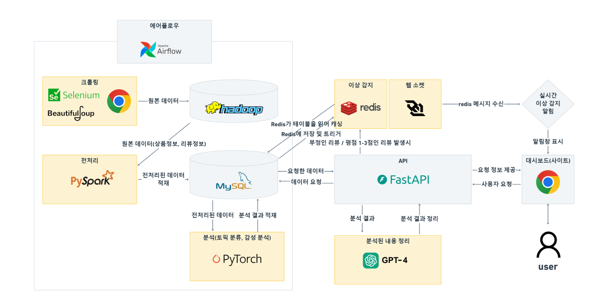
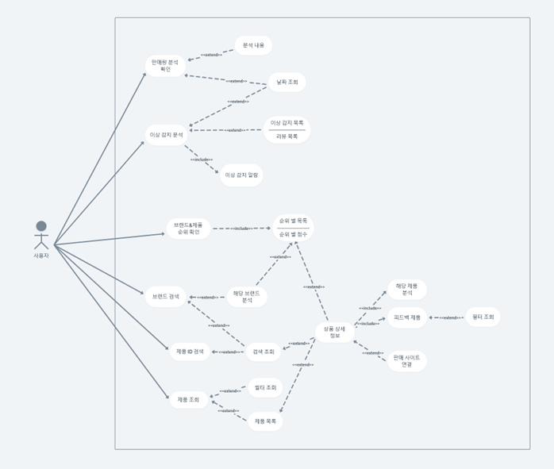

# 🖥️ 운영자 중심의 쇼핑몰 통합 분석 플랫폼,Boss Monitor
개발기간: 2025.01 ~ 2025.03

## 프로젝트 소개
온라인 쇼핑몰 폐업률이 급증하고 있는 지금, 폐업으로부터 살아남기 위해 운영자와 판매자가 가장 집중해야할 부분인 ‘소비자’, 
그중에서도 소비자의 직접적인 목소리인 ‘리뷰 데이터’를 통해 쇼핑몰 , 브랜드 혹은 제품에 대한 소비자의 반응(=리뷰)을 실시간으로 파악하고 
누적된 데이터를 분석하여 운영자와 판매자의 매출증진에 도움이 되는 정보를 제공하는 서비스를 기획 

## 🔧 서비스 기능

- 📊 쇼핑몰 리뷰 크롤링 (무신사)
- 🔄 ETL 자동화 파이프라인 구축 (Apache Airflow 기반)
- 📂 대용량 데이터 저장 및 분산처리 (HDFS + Spark 활용)
- 🧼 데이터 전처리 (PySpark)
- 🧐리뷰 토픽 분류 분석, 리뷰 감성 분류 분석(Pytorch)
- 🧠 GPT기반 솔루션 레포트 (OpenAI)
- 💡 실시간 이상감지 알림 (Redis,Websocket)
- 📈 대시보드로 분석 정보 표시(FastAPI,Chart.js)

## 🖼 프로젝트 아키텍처

